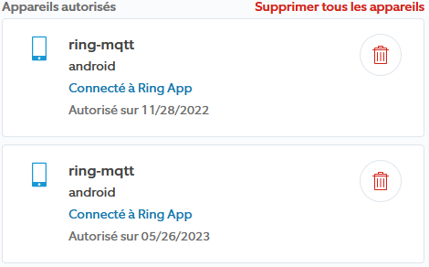

# Changelog mqttRing

>**WICHTIG**
>
>Die vom Plugin verwendete Bibliothek benötigt nodeJS 18, um optimal zu funktionieren.
>Es wird daher empfohlen, Jeedom auf die Version 4.3.19 zu aktualisieren, um abnormale Funktionsweisen zu vermeiden.

>**WICHTIG**
>
>Wenn es keine Informationen über die Aktualisierung gibt, handelt es sich nur um eine Aktualisierung der Dokumentation, der Übersetzung oder des Textes.

# 15/01/2023
- Bild hinzufügen Außensirene

# 04/12/2023
- Fehler behoben, durch den das alte Topic nicht gelöscht wurde, wenn es geändert wurde.

# 12/11/2023
- Unbekannte Befehle werden nicht mehr im Log angezeigt. Reaktivierung in der Konfiguration möglich.
- An-/Aus-Aktion für Lichter erstellen.

# 02/11/2023
- Übersetzter Alarmstatus anstelle von Rohdaten.
- Aktualisierung der Ringbibliothek auf Version 5.6.3

# 10/10/2023
- Hinzufügen von Bildern der Geräte zur besseren Lesbarkeit.
- Informationen über Batterien für Geräte, die über Batterien verfügen, wurden hinzugefügt.
- Aktualisierung der Ringbibliothek auf Version 5.5.2
- Entfernen des Status-Befehls, der keinen Nutzen hat.
- Befehl "online" für WiFi-Geräte hinzugefügt.

# 18/06/2023
- Hinzufügen einer binären Information: Alarm aktiviert. Generischer Typ ALARM_ENABLE_STATE
- Hinzufügen einer binären Information: Alarm ausgelöst. Generischer Typ ALARM_STATE

# 07/06/2023
- Aktualisierung der Ringbibliothek auf Version 5.3.0
- Infos & Aktionen von RING INTERCOM hinzugefügt.
- Wiederherstellung des RTSP-Streams

>**WICHTIG**
>
>Wenn Sie nach dem Upgrade keine Benachrichtigungen erhalten (Klingel,...),
>müssen Sie alle zuvor authentifizierten ring-mqtt-Instanzen aus dem Ring Control Center entfernen.
>
>
>
>Anschließend müssen Sie das Plugin wie bei der Installation wieder verbinden..

# 14/05/2023
- Aktualisierung der Ringbibliothek auf Version 5.2.2.
- Anzeige der Library-Version in der Konfiguration.
- Alarmmeldung nach 1 Minute Ausfallzeit statt sofort.

# 22/12/2022
- Erste stabile Version

# 14/12/2022
- Erste öffentliche Beta
