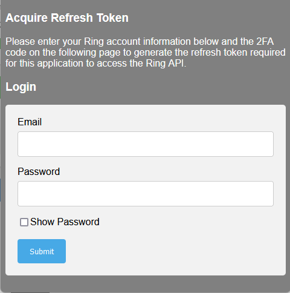
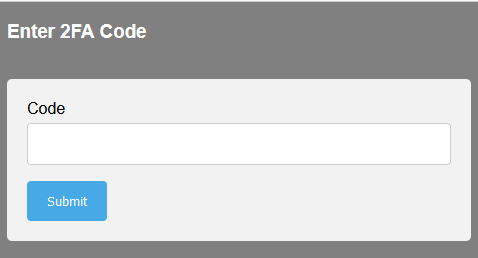

# Plugin mqttRing - BETA

## Beschreibung

Interaktionen mit einem RING-Alarmsystem und Jeedom über MQTT.

Dieses Plugin verwendet [ring-mqtt](https://github.com/tsightler/ring-mqtt), das für Jeedom modifiziert wurde.

Seit November 2013 benötigt das Plugin Jeedom 4.3.19 (nodeJS v18), um optimal zu funktionieren.

## Voraussetzungen

- Sie müssen über ein RING Alarm-Konto verfügen, mit oder ohne Abonnement.
- Dieses Plugin erfordert [MQTT Manager](https://market.jeedom.com/index.php?v=d&p=market_display&id=4213), ein offizielles und kostenloses Plugin.
- Damit die Kamera Aufnahmen macht, müssen Sie ein aktives RING-Abonnement haben.

## Installation

- Laden Sie das Plugin vom Market herunter.
- Aktivieren Sie das Plugin.
- Die Installation der Abhängigkeiten sollte beginnen, sofern die automatische Verwaltung nicht zuvor deaktiviert wurde.

# Konfiguration

## Konfigurationseinstellungen :

- **Root-Topic**: Root-Topic, auf das Jeedom hören soll.
- **Kameraaktivierung**: Ermöglicht das Abrufen und Steuern von Kameras zusätzlich zum Alarm.
- **Modi aktivieren**: Ermöglicht es, das Bedienfeld der Alarmanlage für einen Standort zu simulieren, der nur über Kameras verfügt.
- **Aktivierung der Panik-Schaltflächen**: Ermöglicht die Erstellung der Schaltflächen "Feuer" & "Polizei".
- **RING-Authentifizierung**: Link zur RING-Authentifizierung und um deren Status zu sehen.

## Einrichten des RING-Kontos

- Der Daemon muss gestartet werden, um die Authentifizierung durchzuführen.
- **ACHTUNG**: Der Dämon braucht mehr als eine Minute, um zu starten und somit die Authentifizierung zu ermöglichen.
- Melden Sie sich bei Ihrem RING-Konto an, indem Sie auf der Konfigurationsseite auf "Öffnen" klicken. Dieses Fenster sollte erscheinen.

- Geben Sie Ihre RING-Anmeldedaten ein und klicken Sie auf "Submit".
- Geben Sie dann Ihren Verifizierungscode ein, den Sie per SMS oder über Ihre PSP-Anwendung erhalten haben.

- Wenn Ihre Informationen korrekt sind, wird diese Seite angezeigt. Andernfalls wiederholen Sie den Vorgang.

- Sie können dieses Fenster nun schließen.

## Überprüfung des RING-Kontos

Zu jeder Zeit können Sie herausfinden, ob Ihre Authentifizierung gültig ist. Öffnen Sie einfach die Seite zur Authentifizierung erneut, und wenn alles in Ordnung ist, sehen Sie diese Meldung :

# Ausrüstungen

Die Ausrüstungen sind über das Menü Plugins → Sicherheit zugänglich.

Geräte werden erstellt und konfiguriert, wenn sie vom Daemon entdeckt werden. **Geräte müssen online sein, um entdeckt zu werden**.

## Geräte konfigurieren

Wenn Sie auf ein Gerät klicken, finden Sie seine Informationen :

- **Ausrüstungsname**: Der Name Ihrer Ausrüstung, der von RING abgerufen wurde.
- **Elternobjekt**: Zeigt das Elternobjekt an, zu dem die Ausrüstung gehört.
- **Kategorie**: Hier können Sie die Kategorie der Ausrüstung auswählen.
- **Aktivieren**: Hiermit können Sie Ihre Ausrüstung aktivieren.
- **Sichtbar**: Macht Ihre Ausrüstung auf dem Dashboard sichtbar.

Darunter finden Sie die spezifischen Informationen zu Ihrer Ausrüstung:

- **Marke**: Die Marke der Ausrüstung.
- **Modell**: Das Modell der Ausrüstung
- **Root Topic**: Das MQTT-Root-Topic des Geräts

### Die Befehle

Für jede Ausrüstung kannst du die Befehle sehen, die durch die automatische Entdeckung erstellt wurden.

**Für fortgeschrittene Nutzer** ist es möglich, eigene Befehle zu erstellen, aber Sie müssen das Thema der Information/Aktion kennen, die verlinkt werden soll.

Um diese Topics zu erfahren, setzen Sie das Plugin-Log in den Debug-Modus, starten Sie den Daemon neu und lesen Sie den Inhalt der Datei "MqttRing". Sie können sich auch direkt mit dem MQTT-Broker verbinden.

# Betrieb mit dem Camera-Plugin

Es ist möglich, die Captures und den Videostream von RING-Kameras aus diesem Plugin abzurufen.

- **Schnappschuss-URL**: http://localhost:55123/snapshot/<camera_id>.png (Ersetzen Sie <camera_id> durch die ID Ihrer Kamera).
- **URL des Streams**: rtsp://localhost:8554/<camera_id>_live (Ersetzen Sie <camera_id> durch die ID Ihrer Kamera)

## Kamera-ID abrufen :

Gehen Sie auf die Seite der Ausrüstung, in den spezifischen Einstellungen haben Sie das Topic der Ausrüstung. Die Kamera-ID finden Sie nach dem letzten **/**.

