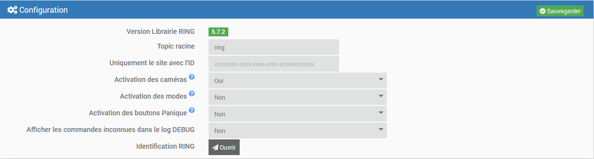
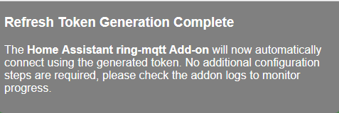
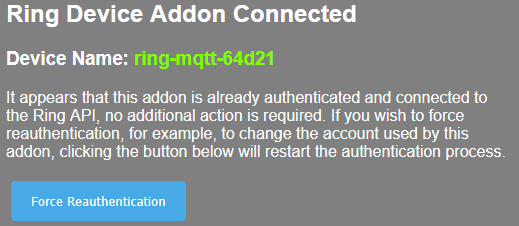
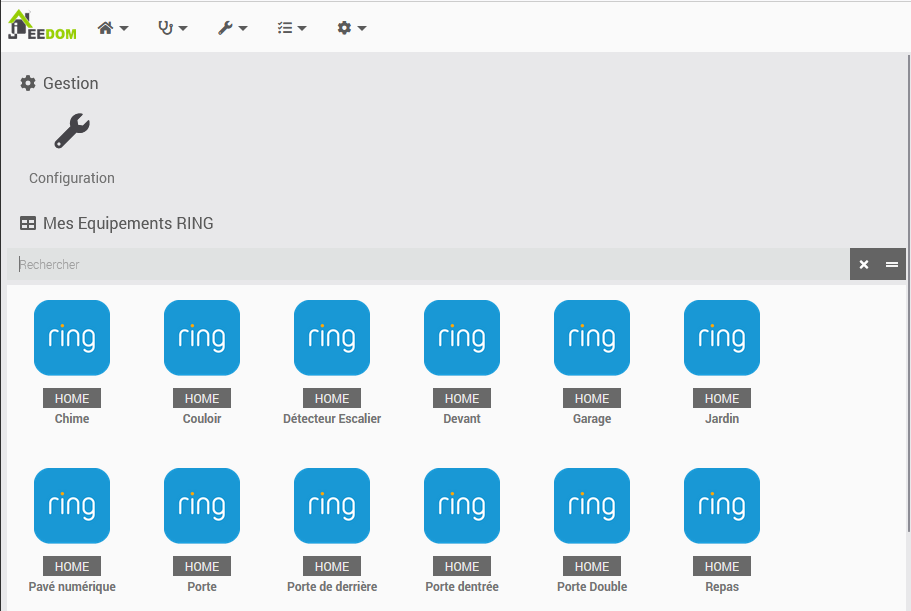
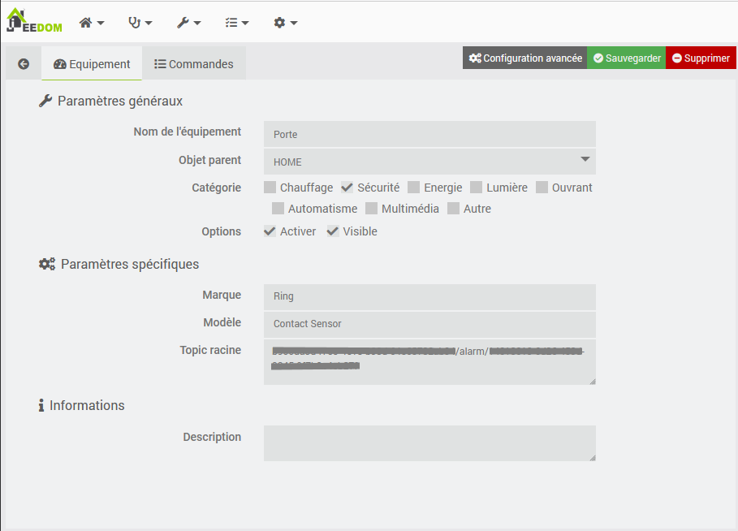

# mqttRing plugin - BETA

## Description

Interaction with a RING and Jeedom alarm system via MQTT.

This plugin uses [ring-mqtt](https://github.com/tsightler/ring-mqtt) modified for Jeedom.

Since November 2023, the plugin require Jeedom 4.3.19 (nodeJS v18) for optimal operation.
Since September 2024, the plugin require Jeedom 4.4.17 (nodeJS v20) for optimal operation.

## Prerequisites

- You must have a RING Alarm account, with or without subscription.
- This plugin requires [MQTT Manager](https://market.jeedom.com/index.php?v=d&p=market_display&id=4213), an official and free plugin.
- To have the camera captures, you must have an active RING subscription.

## Installation

- Download the plugin from the market
- Activate the plugin
- The installation of the dependencies should start unless the automatic management has been deactivated beforehand.

# Configuration

## Configuration parameters :

- **Root Topic**: Root topic that Jeedom should listen to
- **Only the location with ID** : Retrieves only the location with the ID entered.
- **Camera activation**: Allows you to retrieve and control cameras in addition to the alarm.
- **Activation of modes**: Allows you to simulate the alarm control panel for a site with only cameras.
- **Panic Button Activation** : Allow the creation of "Fire" & "Police" buttons.
- **Display unknown commands in the DEBUG log** : Displays the commands not configured in each device in the log.
- **RING Authentication**: Link to RING authentication and to view its status.

## RING Account Setup

- The daemon must be started to perform authentication.
- **WARNING** : The daemon takes more than a minute to start and thus allow authentication.
- Log in to your RING account by clicking on "Open" on the configuration page. This window should appear.

- Enter your RING credentials and click on "Submit".
- Then enter your verification code received by SMS or from your OTP application.

- If your information is correct, this page will be displayed. If not, repeat the procedure.

- You can now close this window.

## Checking the RING account

At any time you can see if your authentication is valid. Just open the authentication page again and if everything is ok, you will see this message:

# Equipment

The equipment can be accessed from the menu Plugins → Security.

Devices are created and configured when discovered by the daemon. **Devices must be online to be discovered**.

## Equipment configuration

By clicking on an equipment, you will find its information:

- **Equipment name**: Name of your equipment retrieved from RING.
- **Parent object**: indicates the parent object to which the equipment belongs.
- **Category**: Allows you to choose the category of the equipment.
- **Activate**: allows you to make your equipment active.
- **Visible**: makes your equipment visible on the dashboard.

Below you will find the specific information about your equipment:

- **Brand**: The brand of the equipment
- **Model**: The model of the equipment
- **Root Topic**: The MQTT root topic of the equipment

### The commands

For each equipment, you can see the commands created by the auto-discovery.

**For advanced users** it is possible to create your own commands but you need to know the topic of the information/action to be linked.

To know these topics, put the plugin log in "Debug" mode, restart the daemon and read the content of the "MqttRing" file. You can also connect directly to the MQTT broker.

# Working with the Camera plugin

It is possible to retrieve captures and video streams from RING cameras from this plugin.

- **Snapshot URL**: http://localhost:55123/snapshot/**<camera_id>**.png (Replace **<camera_id>** with your camera ID)
- **Stream URL**: rtsp://localhost:8554/**<camera_id>**_live (Replace **<camera_id>** with your camera ID)

## Get the camera ID:

Go to the equipment page, in the specific settings you have the Equipment Topic. The camera ID will be found after the last **/**

