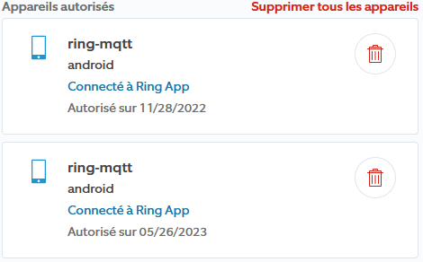

# Changelog mqttRing

>**IMPORTANTE**
>
>La biblioteca utilizada por el plugin requiere nodeJS 18 para un rendimiento óptimo.
>Por lo tanto, se recomienda actualizar Jeedom a la versión 4.3.19 para evitar un funcionamiento anormal.

>**IMPORTANTE**
>
>Si no hay información sobre la actualización, significa que sólo se trata de actualizaciones de documentación, traducción o texto.

# 04/12/2023
- Solucionado el problema de no borrar el tema antiguo al cambiarlo.

# 12/11/2023
- Los comandos desconocidos ya no se muestran en el registro. Reactivación posible en configuración.
- Acción de encendido / apagado creada para las luces.

# 02/11/2023
- Estado de alarma traducido en lugar de datos brutos.
- Actualización de la biblioteca de anillos a la versión 5.6.3

# 10/10/2023
- Imagen del equipo añadida para mayor legibilidad.
- Añadida información sobre baterías para equipos con baterías.
- Actualización de la biblioteca de anillos a la versión 5.5.2
- Eliminación del comando Estado, que no tiene utilidad.
- Adición de un comando "online" para equipos wifi.

# 18/06/2023
- Adición de información binaria: Alarma activada. Tipo genérico ALARM_ENABLE_STATE
- Información binaria añadida: Alarma activada. Tipo genérico ALARM_STATE

# 07/06/2023
- Mise à jour librairie ring à la version 5.3.0
- Ajout des infos & actions de RING INTERCOM.
- Restauration du flux RTSP

>**IMPORTANTE**
>
>Si no recibes ninguna notificación después de la actualización (Timbre,...),
>debe eliminar todas las instancias ring-mqtt autenticadas previamente del Ring Control Center.
>
>
>
>A continuación, tendrá que volver a conectar el plugin como lo hizo cuando lo instaló.

# 14/05/2023
- Actualizar la biblioteca de anillos a la versión 5.2.2.
- Versión de la biblioteca mostrada en la configuración.
- Mensaje de alarma tras 1 minuto de indisponibilidad en lugar de inmediatamente.

# 22/12/2022
- Primera versión estable

# 14/12/2022
- Primera beta pública
