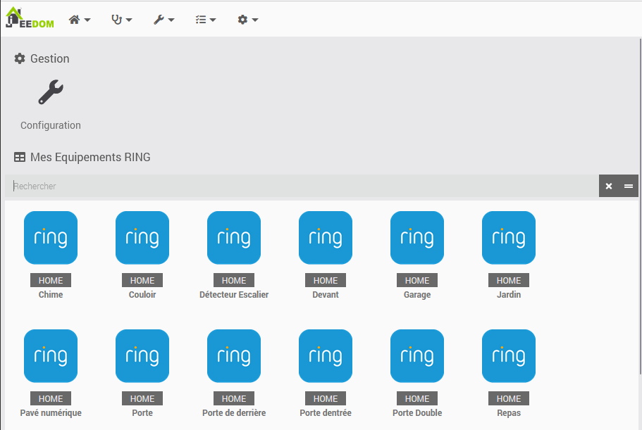

# Plugin mqttRing

## Descripción

Interacción con un sistema de alarma RING y Jeedom vía MQTT.

Este plugin usa [ring-mqtt](https://github.com/tsightler/ring-mqtt) modificado para Jeedom.

Desde noviembre de 2013, el plugin requiere Jeedom 4.3.19 (nodeJS v18) para un funcionamiento óptimo.

## Requisitos previos

- Debes tener una cuenta de RING Alarm, con o sin suscripción.
- Este plugin requiere [MQTT Manager](https://market.jeedom.com/index.php?v=d&p=market_display&id=4213), un plugin oficial y gratuito.
- Para disponer de las capturas de la cámara, debe tener una suscripción RING activa.

## Instalación

- Descargar el plugin del mercado
- Activar el plugin
- La instalación de las dependencias debería comenzar a menos que se haya desactivado previamente la gestión automática.

# Configuración

## Parámetros de configuración :

Configuración](../images/configuration.png)

- **Tema raíz**: Tema raíz que Jeedom debe escuchar
- **Activación de cámaras**: Permite recuperar y controlar cámaras además de la alarma.
- **Activación de modos**: Permite simular el panel de control de alarma para un sitio con sólo cámaras.
- **Activación de Botones de Pánico**: Permite la creación de botones de "Fuego" y "Policía".
- **Autenticación RING** : Enlace a la autenticación RING y para ver su estado.

## Configuración de la cuenta RING

- El demonio debe iniciarse para realizar la autenticación.
- **ADVERTENCIA** : El demonio tarda más de un minuto en iniciarse y, por tanto, en permitir la autenticación.
- Conéctese a su cuenta RING haciendo clic en "Abrir" en la página de configuración. Debería aparecer esta ventana.

- Introduzca sus credenciales RING y haga clic en "Enviar".
- A continuación, introduce el código de verificación recibido por SMS o desde tu aplicación OTP.

- Si sus datos son correctos, aparecerá esta página. Si no es así, repita el procedimiento.

- Ahora puede cerrar esta ventana.

## Comprobación de la cuenta RING

En cualquier momento puedes ver si tu autenticación es válida. Abre de nuevo la página de autenticación y, si todo va bien, verás este mensaje:

# Equipo

Se puede acceder al equipo desde el menú Plugins → Seguridad.

Los dispositivos se crean y configuran cuando son descubiertos por el demonio. **Los dispositivos deben estar conectados para ser detectados**.

## Configuración del equipo

Al hacer clic en un equipo, encontrará su información:

- **Nombre del equipo**: Nombre de su equipo recuperado de RING.
- **Objeto padre**: indica el objeto padre al que pertenece el equipo.
- **Categoría**: Permite elegir la categoría del equipo.
- **Activar**: permite activar el equipo.
- **Visible**: hace que su equipo sea visible en el salpicadero.

A continuación encontrará información específica sobre su equipo:

- **Marca**: La marca del equipo
- **Modelo**: El modelo del equipo
- **Tema raíz**: El tema raíz MQTT del equipo.

### Los comandos

Para cada equipo, puede ver los comandos creados por el autodescubrimiento.

**Para usuarios avanzados** es posible crear sus propios comandos, pero es necesario conocer el tema de la información/acción a enlazar.

Para conocer estos temas, pon el log del plugin en modo "Debug", reinicia el demonio y lee el contenido del archivo "MqttRing". También puede conectarse directamente al broker MQTT.

# Trabajar con el plugin Cámara

Es posible recuperar capturas y secuencias de vídeo de cámaras RING desde este plugin.

- **URL de la instantánea**: http://localhost:55123/snapshot/<camera_id>.png (Sustituya <camera_id> por el ID de su cámara)
- **URL del flujo**: rtsp://localhost:8554/<camera_id>_live (Sustituya <camera_id> por el ID de su cámara)

## Obtener el ID de la cámara:

Ve a la página de equipamiento, en los ajustes específicos tienes el Tema de Equipamiento. El ID de la cámara se encontrará después del último **/**

