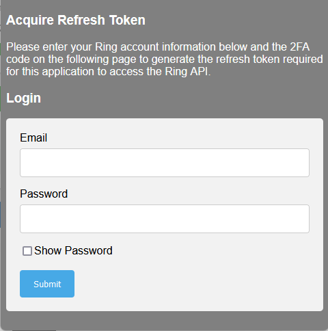
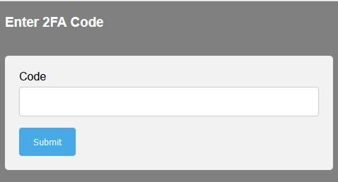
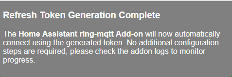
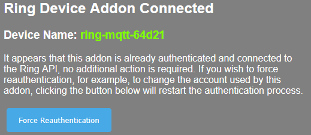
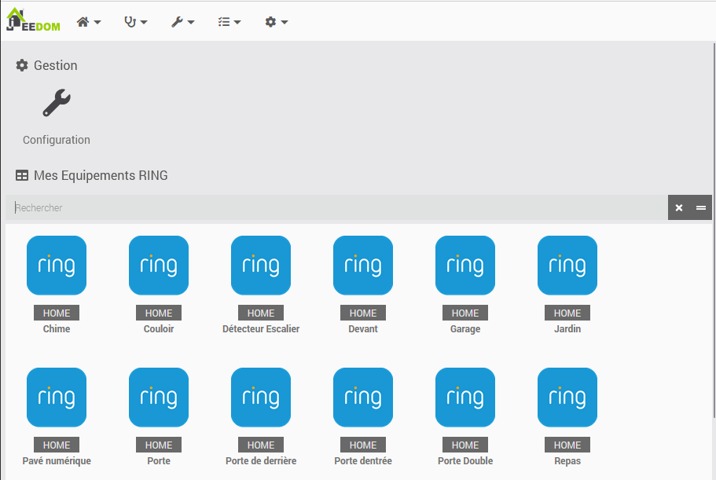
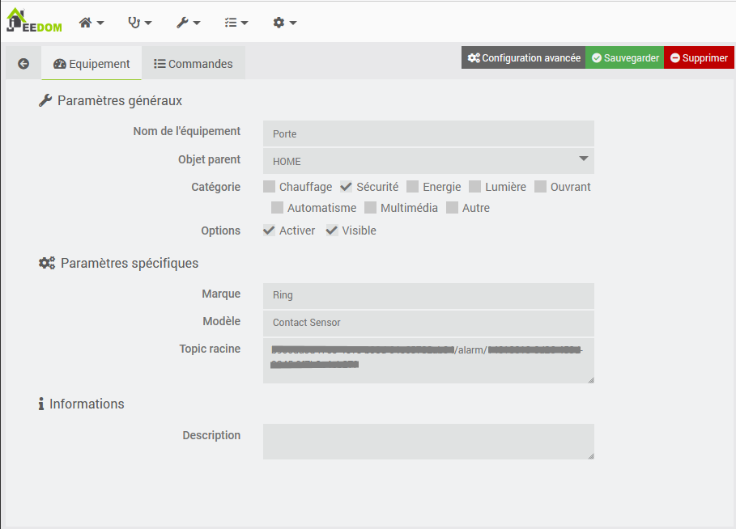
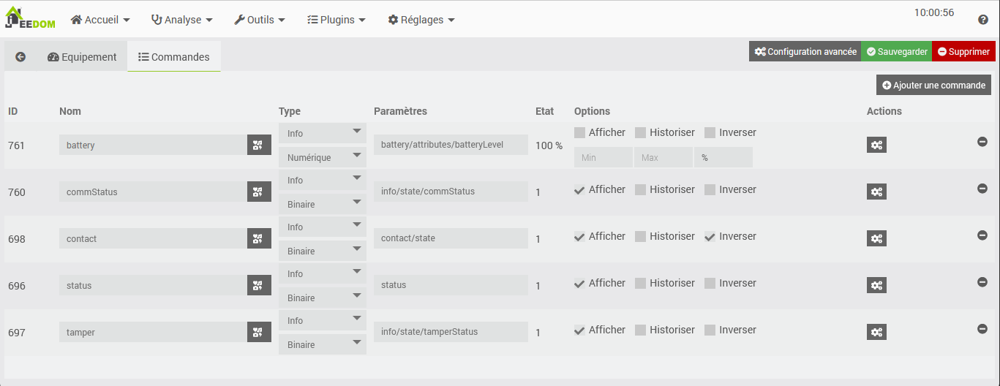
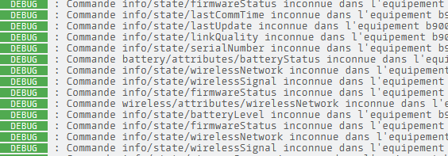
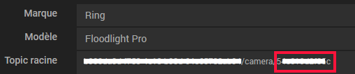

# Plugin mqttRing - BETA

## Descripción

Interacción con un sistema de alarma RING y Jeedom vía MQTT.

Este plugin usa [ring-mqtt](https://github.com/tsightler/ring-mqtt) modificado para Jeedom.

Desde noviembre de 2023, el plugin requiere Jeedom 4.3.19 (nodeJS v18) para un funcionamiento óptimo.
Desde septiembre de 2024, el plugin requiere Jeedom 4.4.17 (nodeJS v20) para un funcionamiento óptimo.

## Requisitos previos

- Debes tener una cuenta de RING Alarm, con o sin suscripción.
- Este plugin requiere [MQTT Manager](https://market.jeedom.com/index.php?v=d&p=market_display&id=4213), un plugin oficial y gratuito.
- Para disponer de las capturas de la cámara, debe tener una suscripción RING activa.

## Instalación

- Descargar el plugin del mercado
- Activar el plugin
- La instalación de las dependencias debería comenzar a menos que se haya desactivado previamente la gestión automática.

# Configuración

## Parámetros de configuración :

Configuración](../images/configuration.png)

- **Tema raíz**: Tema raíz que Jeedom debe escuchar
- **Activación de cámaras**: Permite recuperar y controlar cámaras además de la alarma.
- **Activación de modos**: Permite simular el panel de control de alarma para un sitio con sólo cámaras.
- **Activación de Botones de Pánico**: Permite la creación de botones de "Fuego" y "Policía".
- **Autenticación RING** : Enlace a la autenticación RING y para ver su estado.

## Configuración de la cuenta RING

- El demonio debe iniciarse para realizar la autenticación.
- **ADVERTENCIA** : El demonio tarda más de un minuto en iniciarse y, por tanto, en permitir la autenticación.
- Conéctese a su cuenta RING haciendo clic en "Abrir" en la página de configuración. Debería aparecer esta ventana.

- Introduzca sus credenciales RING y haga clic en "Enviar".
- A continuación, introduce el código de verificación recibido por SMS o desde tu aplicación OTP.

- Si sus datos son correctos, aparecerá esta página. Si no es así, repita el procedimiento.

- Ahora puede cerrar esta ventana.

## Comprobación de la cuenta RING

En cualquier momento puedes ver si tu autenticación es válida. Abre de nuevo la página de autenticación y, si todo va bien, verás este mensaje:

# Equipo

Se puede acceder al equipo desde el menú Plugins → Seguridad.

Los dispositivos se crean y configuran cuando son descubiertos por el demonio. **Los dispositivos deben estar conectados para ser detectados**.

## Configuración del equipo

Al hacer clic en un equipo, encontrará su información:

- **Nombre del equipo**: Nombre de su equipo recuperado de RING.
- **Objeto padre**: indica el objeto padre al que pertenece el equipo.
- **Categoría**: Permite elegir la categoría del equipo.
- **Activar**: permite activar el equipo.
- **Visible**: hace que su equipo sea visible en el salpicadero.

A continuación encontrará información específica sobre su equipo:

- **Marca**: La marca del equipo
- **Modelo**: El modelo del equipo
- **Tema raíz**: El tema raíz MQTT del equipo.

### Los comandos

Para cada equipo, puede ver los comandos creados por el autodescubrimiento.

**Para usuarios avanzados** es posible crear sus propios comandos, pero es necesario conocer el tema de la información/acción a enlazar.

Para conocer estos temas, pon el log del plugin en modo "Debug", reinicia el demonio y lee el contenido del archivo "MqttRing". También puede conectarse directamente al broker MQTT.

# Trabajar con el plugin Cámara

Es posible recuperar capturas y secuencias de vídeo de cámaras RING desde este plugin.

- **URL de la instantánea**: http://localhost:55123/snapshot/<camera_id>.png (Sustituya <camera_id> por el ID de su cámara)
- **URL del flujo**: rtsp://localhost:8554/<camera_id>_live (Sustituya <camera_id> por el ID de su cámara)

## Obtener el ID de la cámara:

Ve a la página de equipamiento, en los ajustes específicos tienes el Tema de Equipamiento. El ID de la cámara se encontrará después del último **/**

