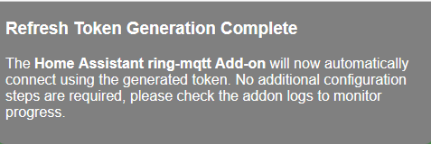
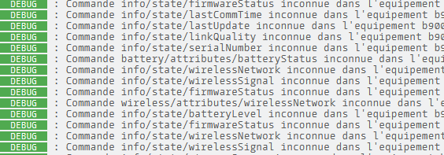

# Plugin mqttRing

## Description

Interactions avec un système d'alarme RING et Jeedom via MQTT.

Ce plugin utilise [ring-mqtt](https://github.com/tsightler/ring-mqtt) modifié pour Jeedom.

Depuis novembre 2013, le plugin requiert Jeedom 4.3.19 (nodeJS v18) pour un fonctionnement optimal.
Depuis septembre 2024, le plugin requiert Jeedom 4.4.17 (nodeJS v20) pour un fonctionnement optimal.

## Pré-Requis

- Vous devez disposer d'un compte RING Alarm, avec ou sans souscription à l'abonnement.
- Ce plugin requiert [MQTT Manager](https://market.jeedom.com/index.php?v=d&p=market_display&id=4213), plugin officiel et gratuit.
- Pour avoir les captures des caméras, vous devez disposer d'un abonnement RING actif.

## Installation

- Télécharger le plugin depuis le market
- Activer le plugin
- L’installation des dépendances devrait débuter sauf si la gestion automatique a été désactivée au préalable.

# Configuration

## Paramètres de configuration :

- **Topic racine** : Sujet racine que Jeedom doit écouter
- **Activation des caméras** : Permet de récupérer et piloter les caméras en plus de l'alarme.
- **Activation des modes** : Permet de simuler le panneau de contrôle de l'alarme pour un site ne disposant que de caméras.
- **Activation des boutons Panique** : Autoriser la création des boutons "Incendie" & "Police".
- **Identification RING** : Lien vers l'authentification RING et pour voir son statut.

## Configuration du compte RING

- Le démon doit être démarré pour procéder à l'authentification.
- **ATTENTION** : Le démon met plus d'une minute pour démarrer et donc permettre l'authentification.
- Identifier vous à votre compte RING en cliquant sur "Ouvrir" sur la page de configuration. Cette fenetre doit apparaitre.

- Entrez vos identifiants RING et cliquez sur "Submit".
- Entrez ensuite votre code de vérification reçu par SMS ou depuis votre application OTP.

- Si vos informations sont correctes, cette page va s'afficher. Sinon, recommencer la procédure.

- Vous pouvez maintenant fermer cette fenêtre.

## Vérification du compte RING

A tout moment vous pouvez savoir si votre authentification est valide. Il suffit d'ouvrir à nouveau la page d'autentification et si tout est ok, vous verrez ce message :

# Equipements

Les équipements sont accessibles à partir du menu Plugins → Sécurité.

Les équipements sont crées et configurés lors de leur découverte par le démon. **Les appareils doivent être en ligne pour être découvert**.

## Configuration des équipements

En cliquant sur un équipement, vous retrouverez ses informations :

- **Nom de l’équipement** : Nom de votre équipement récupéré depuis RING.
- **Objet parent** : indique l’objet parent auquel appartient l’équipement.
- **Catégorie** : permet de chosir la catégorie de l'équipement.
- **Activer** : permet de rendre votre équipement actif.
- **Visible** : rend votre équipement visible sur le dashboard.

En dessous vous retrouvez les informations spécifiques de votre équipement :

- **Marque** : La marque de l'équipement
- **Modèle** : Le modèle de l'équipement
- **Topic Racine** : Sujet racine MQTT de l'équipement

### Les commandes

Pour chaque équipements, vous pouvez voir les commandes créér par l'auto-découverte.

**Pour les utilisateurs avancés** il est possible de créer vos propres commandes mais il vous faut connaitre le topic de l'information / action qui doit être lié.

Pour connaitre ces topics, mettre le log du plugin en mode "Debug", relancer le démon et lire le contenu du fichier "MqttRing". Vous pouvez aussi vous connecter directement au broker MQTT.

# Fonctionnement avec le plugin Camera

Il est possible de récuperer les captures et le flux vidéo des caméras RING depuis ce plugin.

- **URL de snapshot** : http://localhost:55123/snapshot/<camera_id>.png
- **URL du flux** : rtsp://localhost:8554/<camera_id>_live

## Obtenir l'ID de la caméra :

Rendez-vous sur la page de l'équipement, dans les paramètres spécifiques vous avez le Topic de l'équipement. L'ID de camera se trouva après le dernier **/**

